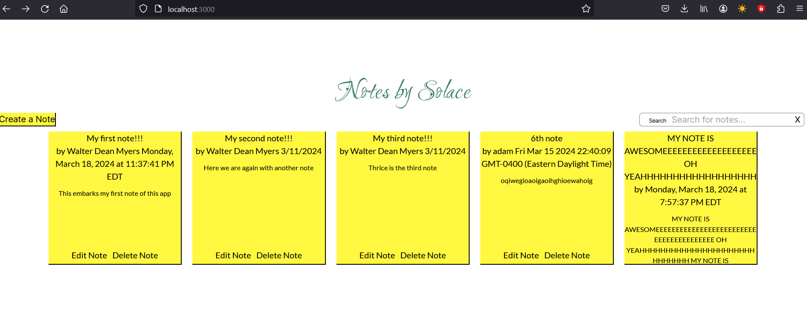

This is a [Next.js](https://nextjs.org/) project bootstrapped with [`create-next-app`](https://github.com/vercel/next.js/tree/canary/packages/create-next-app).

## Getting Started

<b>Make sure you open into NotesBySolace_master directory to be able to do the below steps correctly.  </b>

To run this application, we will need to do a few things.

First, lets install Node to install the required packages to run the application.

https://nodejs.org/en/download

Then, we need to clone this repo or download the ZIP file and extract it.

Once the project is downloaded/cloned, in the main directory of the project. We will need to run the development server:

```bash
npm run dev
# or
yarn dev
# or
pnpm dev
# or
bun dev
```

Open [http://localhost:3000](http://localhost:3000) with your browser to see the result.

With the app running, some prepoulated notes with be there. You have the ability to search, create note via the button, edit or delete a note via buttons on each individual note. Any changes that are submitted with each of the actions will be saved to SQLite DB located in the project (notes.db)

## Struggles in the Project's bulid process

Through doing this project, definitely came with some hurdles. One I would take back is me being sick for week at the beginning of timeline receiving this (which would affect my decisions for certain solutions for the sake of time, would love to use AWS). The others are below.

• Learning NextJS from scratch. More so recently in my previous position, I have been coding in Angular so it took some time to get up to speed with NextJS. If I would change something is to give myself more time with NextJS to flesh the app out better.
• Realizing Vercel cannot write to SQLite DB so I had to use a different hosting platform for DB.
• Setting up Supabase (hosting service for DB) and getting it to work with queries. Unforturnately, I have not been able to get the insert func for Supabase API to work (it seems request is successful but data is not inserting in the table; will require more troubleshooting, I have a suspicion something asynchronously is not kicking off right between receiving data from front end to passing it to the Supabase API via POST route in data API I have created)

### Things I would Improve
• Making the Form validation more efficient. I built out basic form validation and decided to come back to this later once I tackled the bigger tasks I had left.
• Improving Search functionality to have filters
• Put the app in company colors and fonts. Through research, it seems some fonts were licensed and I was not able to find alternative that were similar in TailwindCSS so I had to choose something close from Google Fonts.

<a href="https://notes-app-kohl-zeta.vercel.app/">Live site</a>
(Note that I will have code commented out for live production that is still buggy so the app can still work locally; Included picture below of live site would look like with find all query working)

